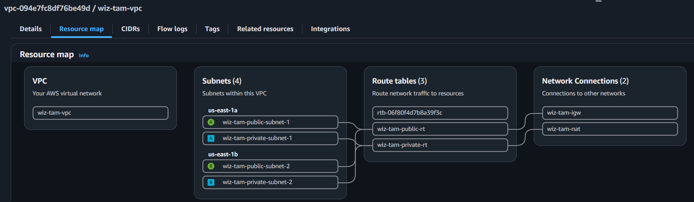

# Presentation Notes

## Phase 1 — Networking

**What was built:**
- 1 VPC (`10.0.0.0/16`) via Terraform module (`terraform/modules/network`)
- 2 public subnets (`10.0.0.0/24`, `10.0.1.0/24`) across 2 AZs
- 2 private subnets (`10.0.10.0/24`, `10.0.11.0/24`) across 2 AZs
- Internet Gateway attached to VPC, routed from public subnets
- 1 NAT Gateway (in public subnet A) + Elastic IP, routed from private subnets
- Separate route tables for public (→ IGW) and private (→ NAT) traffic

**Why this design:**
- 2 AZs minimum required by EKS control plane for HA
- Public/private split enforces the exercise requirement that EKS worker
  nodes live in a private subnet, while still allowing internet-facing
  resources (Mongo VM's SSH, load balancer) in public subnets
- NAT Gateway lets private subnet resources (EKS nodes) reach the internet
  for image pulls/updates without being directly internet-reachable
- Subnets tagged `kubernetes.io/role/elb` / `internal-elb` so the AWS Load
  Balancer Controller can auto-discover correct subnets when provisioning
  ingress load balancers later (Phase 4)
- Consistent tagging (`Project`, `Environment`, `ManagedBy`) applied across
  all resources — supports asset context/grouping, relevant to how CNAPP
  tools like Wiz use tags for inventory and risk context

**Approach / process:**
- Built manually via AWS Console first to understand each component
- Tore down console-built resources, rebuilt identically via Terraform
  module for reproducibility or IaC deployment (per exercise DevOps requirement)
- Verified via `terraform plan` (14 resources: 1 VPC, 4 subnets, 1 IGW,
  1 EIP, 1 NAT GW, 2 route tables, 4 associations) before `apply`

**Challenges / decisions:**
- Terraform AWS provider initially failed with "no valid credential
  sources" — resolved by configuring AWS CLI credentials (CloudLabs
  temporary/session credentials) rather than hardcoding keys in code
- Decided against committing `.tfstate` to VCS (contains resource
  metadata, risk of conflicts/exposure) — added to `.gitignore`
- Chose to commit `.terraform.lock.hcl` for provider version reproducibility